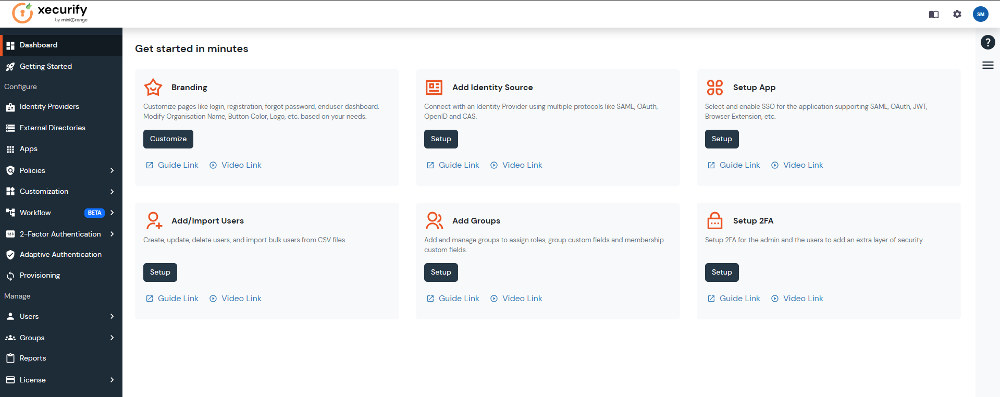
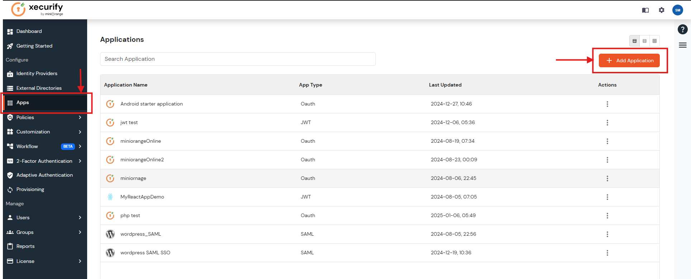
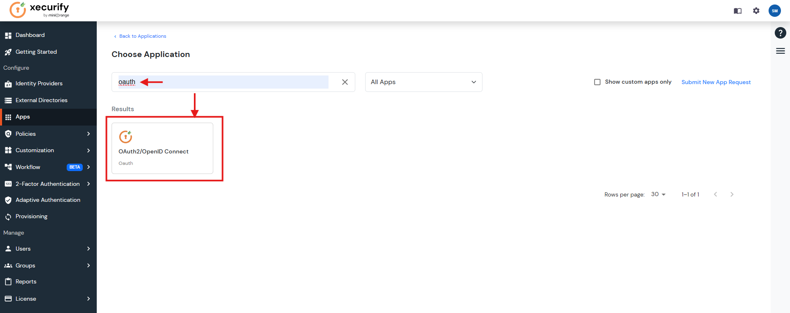
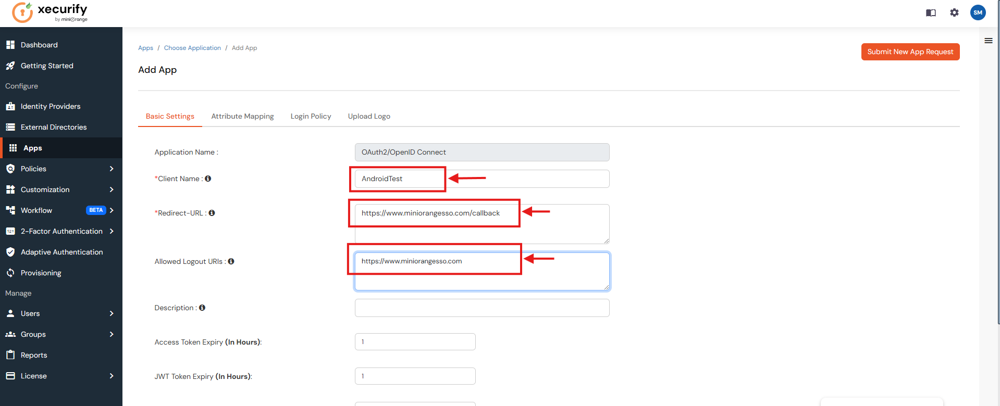
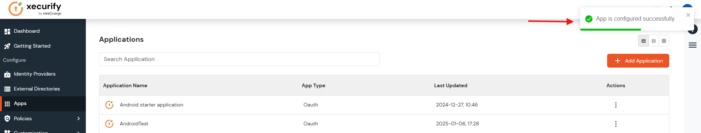
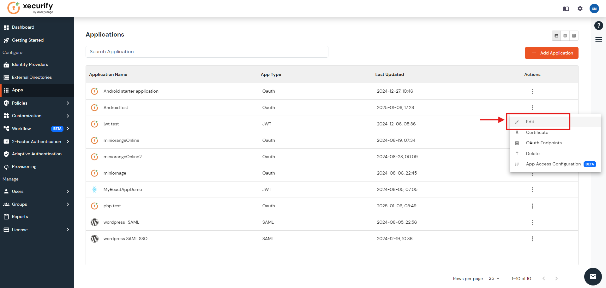
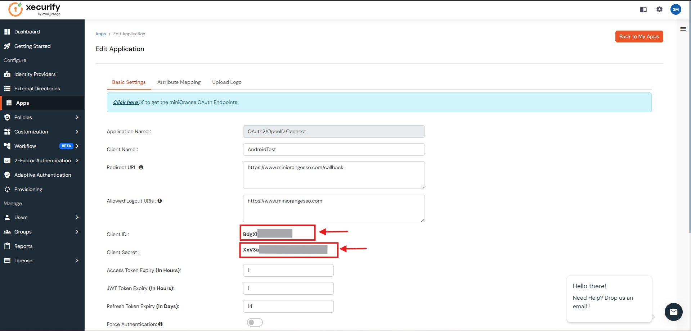
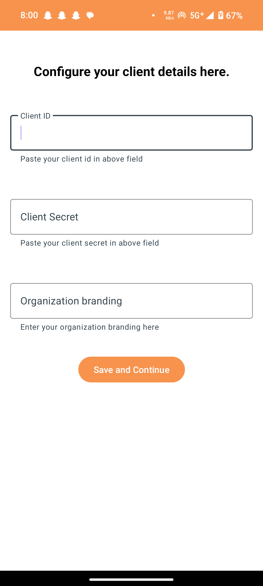
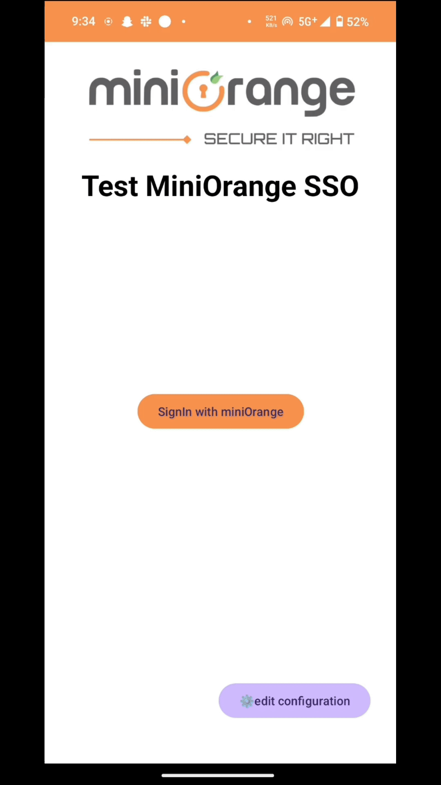

This Android application demonstrates how miniOrange SSO works with an Android app using OAuth authentication. It shows how users can easily log in using their miniOrange credentials.

The process of integration is broken down into two simple steps:
1. [Setting Up OAuth Application at miniOrange](https://github.com/miniOrangeDev/miniOrange-Android-SSO-example-app?tab=readme-ov-file#setting-up-oauth-application-at-miniorange)
2. [Setting Up Starter Application in Android](https://github.com/miniOrangeDev/miniOrange-Android-SSO-example-app?tab=readme-ov-file#setting-up-starter-application-in-android)

   
This demo app helps customers understand how simple it is to integrate miniOrange SSO into their own Android apps. With the miniOrange connector, the integration process is straightforward and works just like in the demo, making it easy to add secure Single Sign-On (SSO) to any Android application.

# Setting Up OAuth Application at miniOrange

##  1. Sign Up and Log In -
[Sign Up](https://www.miniorange.com/businessfreetrial) to the miniorange website and [login](https://login.xecurify.com/moas/login) using your credentials to view the below dashboard. 
Make sure you've set up the [organization branding](https://www.miniorange.com/iam/content-library/admin-docs/branding-and-customization).

&nbsp;
##  2. Access the Apps Section -
Navigate to the "Apps" section on the left side menu and Click on "Add Application" button located at the top right corner of the page..

&nbsp;
##  3. Select OAuth2/OpenID Connect
Search for "OAuth" and select "OAuth2/OpenID Connect" with the MiniOrange icon.

&nbsp;
##  4. Configure Application Details
* Enter a name for your application in the "Client Name" field 
* provide the Redirect-URL as `https://www.miniorangesso.com/callback` 
* Provide the Allowed Logout URIs as `https://www.miniorangesso.com`. 
* Scroll down and Click "Save".

&nbsp;
##  5. Confirm Creation
A message “App is configured successfully.” will appear confirming the successful creation of the OAuth application on MiniOrange.

&nbsp;
##  6. Retrieve Client Credentials
Locate your application name in the applications list, click on three dots menu, and select "Edit". 

&nbsp;
##  7. Copy Client Id and Secret 
Now copy Client Id and Client Secret and store it somewhere safe for further use.

&nbsp;
&nbsp;
&nbsp;
# Setting Up Starter Application in Android

## 1. Download the Application  
[Click here](https://github.com/miniOrangeDev/miniOrange-Android-SSO-example-app/raw/refs/heads/main/miniOrange.apk) to directly download the test application for miniOrange Android SSO.  

## 2. Add Supported Links to the App (for versions greater than Android 12 API level 31)
Tap and hold on app icon to visit the app info section and add the supported link as `https://www.miniorangesso.com`.  

## 3. Paste the Client Credentials (ID and Secret)  
1. Open the application and click on `Continue to Setup`.  
2. Select `Yes` and paste the **Client ID** and **Client Secret** that were copied earlier.  
3. Add the **Organization Branding**.
4. Click on `Save and Continue`.  

## 4. Test OAuth  
Click on  **Sign In with miniOrange** button, enter your login credentials, and you will be redirected back to the app, where you will be logged in.  

